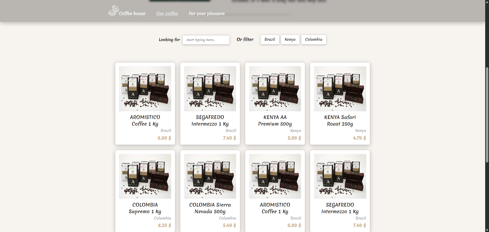

# ☕ Coffee Shop — React + TypeScript + Vite

A small educational project created to practice **React**, **TypeScript**, **SCSS (BEM)**, **routing**, **animations**, and working with component architecture.

The project demonstrates my ability to create clean UI, structure code effectively, and build reusable, scalable components.

---

## 🚀 Technologies

- **React 18**
- **TypeScript**
- **Vite**
- **React Router**
- **Framer Motion**
- **SCSS + BEM**
- **CSS Modules / SCSS Architecture**
- **Lazy Loading**
- **Responsive Layout**

---

## 📸 Screenshots

### Home Page


### Other Page


### Product Cards



---

## 🔍Features

- Product list with filtering
- Search by product name
- Country‑based filtering
- Smooth page transitions
- Dynamic product details
- Responsive layout
- Optimized WebP images

## Clean SCSS architecture with BEM

## 📦 Project launch

```bash
npm install
npm run dev
```
