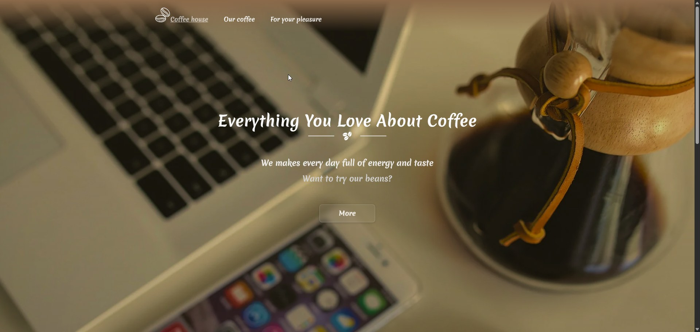
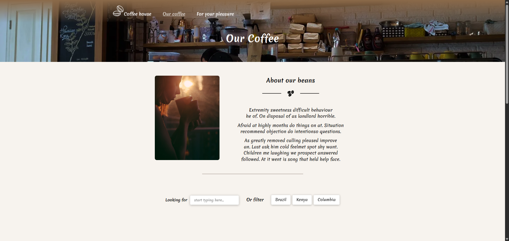

# ☕ Coffee Shop — React + TypeScript + Vite

A small educational project created to practice **React**, **TypeScript**, **SCSS (BEM)**, **routing**, **animations**, and working with component architecture.

The project is not commercial — it is a demonstration of my skills in building a modern interface, structuring code, and working with UI components.

---

## 🚀 Technologies

- **React 18**
- **TypeScript**
- **Vite**
- **React Router**
- **Framer Motion**
- **SCSS + BEM**
- **CSS Modules / SCSS Architecture**
- **Lazy Loading**
- **Responsive Layout**

---


## 📸 Screenshots

### Home Page


### Other Page


### Product Cards


---

## 🔍Functionality

- Product list view
- Product search
- Country filtering
- Transition animations
- Dynamic product pages
- Responsive layout
- Optimized images (WebP)

---

## 📦 Project launch

```bash
npm install
npm run dev
